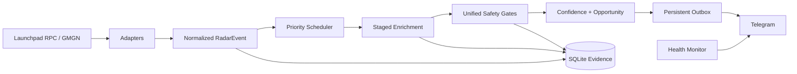

# Meme Radar

Meme Radar 是一个只读、多链、可审计的 Meme 代币发现与信号推送系统。它负责发现、标准化、分阶段补全、风险过滤、评分、Telegram outbox 和健康告警，不包含私钥、签名、广播或自动交易能力。

## 支持范围

- BSC：Four.Meme 原生 RPC 事件与 GMGN 成长候选。
- Base：Clanker V4 原生 RPC 事件与 GMGN 成长候选。
- Robinhood Chain：Pons V2 发射与曲线成交；支持低频 HTTP 轮询和 WSS 回退。
- Solana：GMGN 多类型早期候选，经独立安全与成交门控后输出确认信号。

## 核心原则

- `fail closed`：市值、持有人、安全或开发者证据缺失时不推送。
- 分阶段补全：先用低成本信息排优先级，再按时间点补市场、持有人、开发者与安全证据。
- 发现不等于推荐：只有完成全部硬门并达到最终等级的候选才进入 outbox。
- 决策可复现：原始载荷、标准事件、特征、规则版本和通知状态均持久化。
- 只读边界：RPC客户端只开放读取方法；仓库没有钱包或交易执行路径。

## 数据流



## 快速开始

要求 Python 3.9+。

```bash
python3 -m venv .venv
. .venv/bin/activate
python -m pip install -e .
PYTHONDONTWRITEBYTECODE=1 PYTHONPATH=src \
  python -m unittest discover -s tests -p 'test_*.py'
```

复制配置模板并只在本机填写：

```bash
cp .env.example .env
chmod 600 .env
```

Telegram 默认关闭。请先使用隔离数据库做 DRY_RUN，再考虑服务化部署。

## 文档

- [系统架构](docs/ARCHITECTURE.md)
- [信号与风控策略](docs/SIGNAL_POLICY.md)
- [数据源与故障转移](docs/DATA_SOURCES.md)
- [部署指南](docs/DEPLOYMENT.md)
- [运行与告警](docs/OPERATIONS.md)
- [补全吞吐设计](docs/ENRICHMENT_THROUGHPUT.md)
- [后验效果评估](docs/OUTCOME_EVALUATION.md)
- [安全模型](docs/SECURITY.md)
- [仓库公开范围](docs/REPOSITORY_SCOPE.md)

## 非目标

- 不执行买入或卖出。
- 不管理钱包、私钥或助记词。
- 不保证收益，也不把观察样本当作交易建议。
- 不把单一第三方评分视为最终安全结论。

本仓库暂未附带开源许可证；除非另行声明，保留全部权利。
