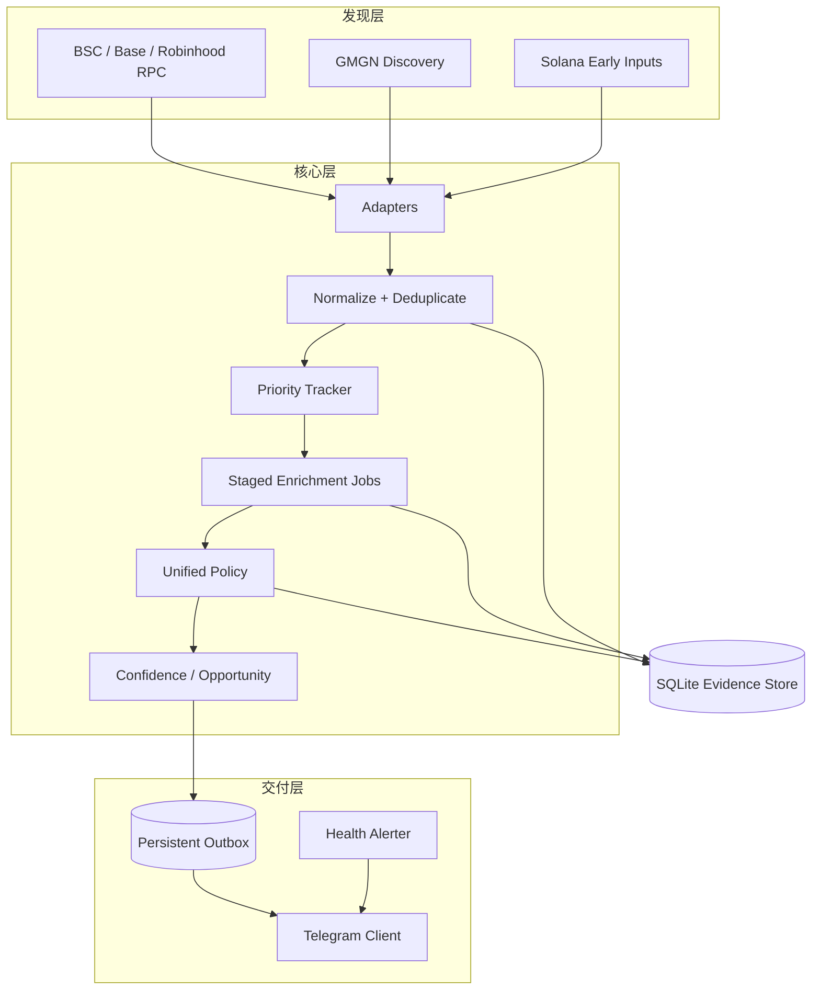

# 系统架构

## 组件边界

Meme Radar 将发现、证据补全、决策和通知拆成可独立恢复的层。任何一层失败都不能绕过安全门直接推送。

## 发现层

EVM链使用受限JSON-RPC客户端和发射台事件适配器。GMGN只增加候选与结构化证据，不能直接触发通知。Solana使用独立sidecar，以避免一种链的供应商或数据模型故障影响其他链。

Robinhood Pons曲线采集器同时记录发射、买卖和生命周期事件。生产设计支持官方公共HTTP低频合并轮询，失败时切换到受管WSS；实时事件采用接收时间，随后允许主事件源在身份完全一致时校正区块时间。

## 标准化与幂等

所有适配器输出统一的 `RadarEvent`。事件身份由来源、链、交易和日志位置等稳定字段构成。原始载荷以摘要关联，重放不会产生第二个逻辑事件。

SQLite保存：

- 原始载荷和批次；
- 标准事件；
- 特征快照和供应商观察；
- 版本化决策；
- 分阶段补全任务；
- Telegram outbox和发送认领。

## 调度与补全

`PriorityTracker` 只决定API预算先给谁，不改变风险或最终等级。调度参考新鲜度、元数据完整性、创建者存在、叙事聚集、跨链聚集、链公平权重和创建者短时批量发币惩罚。

补全任务持久化，服务重启后继续。供应商限流使用冷却、预算和延迟重试，不把“接口失败”解释为“安全通过”。

## 决策与交付

统一策略先执行硬门，再计算置信度和机会分。只有规则允许的最终结果进入持久outbox。发送器执行去重、速率限制、重试和未知结果保护。

健康告警与候选通知分离。数据源故障不会阻塞已完成的安全候选；短暂断线经过持续时间和恢复去抖，避免异常/恢复消息抖动。

## 进程模型

- `meme-radar`：主发现、补全、评分和outbox。
- `meme-radar-pons-curve-shadow`：Robinhood曲线证据采集。
- `meme-radar-pons-curve-notifier`：Robinhood独立门控通知。
- `meme-radar-sol-early`：Solana早期多类型确认。
- `meme-radar-health-alert`：数据源与队列健康告警。
